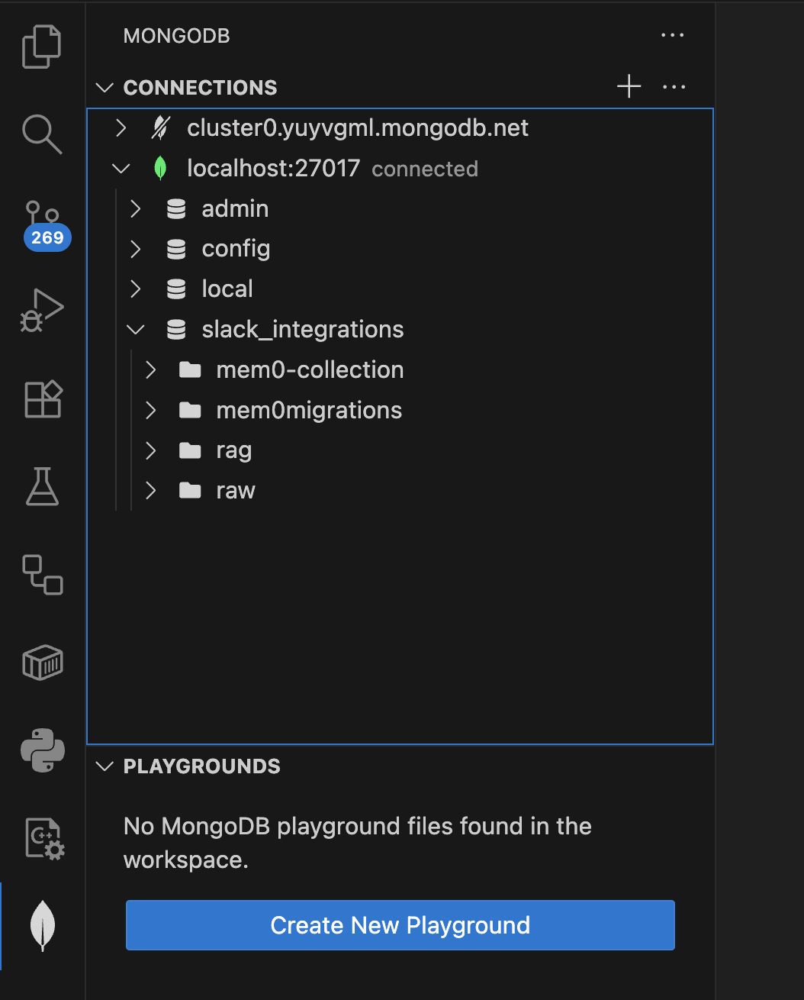
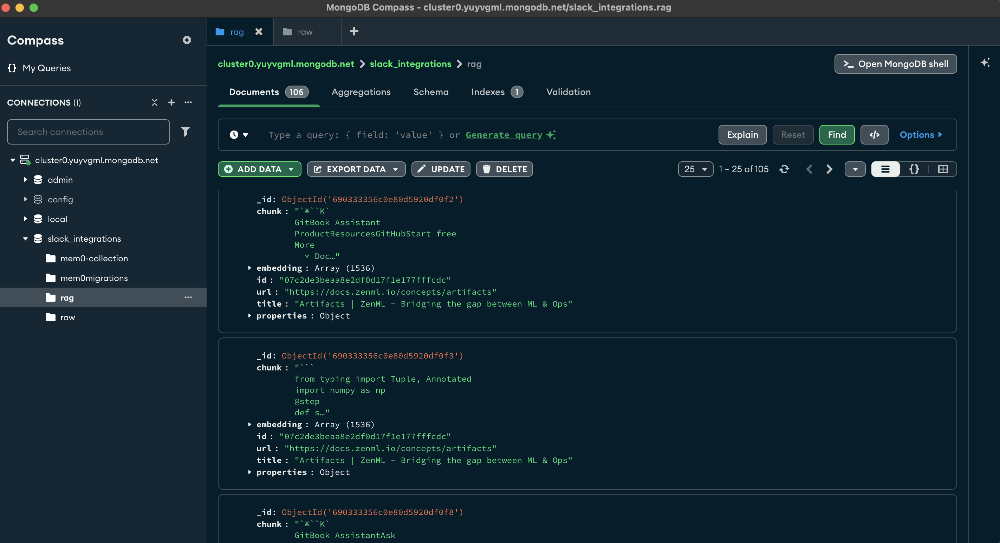

# 🚀 Slack Integrations Online Pipeline

**Note** that this module is entirely independent of the offline ML pipelines. Thus, it comes with its own set of dependencies and requirements. Also, to run this module, you must first go through the steps from the [Offline ML Pipelines](../slack-integrations-offline), which will populate the vector database and other required resources.

# 📑 Table of Contents

- [📋 Prerequisites](#-prerequisites)
- [🎯 Getting Started](#-getting-started)
- [📁 Project Structure](#-project-structure)
- [🏗️ Set Up Your Local Infrastructure](#-set-up-your-local-infrastructure)
- [⚡️ Running the Code](#️-running-the-code)

# 📋 Prerequisites

We depend on the same prerequisites as the offline ML pipelines. Just make sure to fill in the `.env` file with the correct credentials.

## Local Tools

For all the modules, you'll need the following tools installed locally:

| Tool | Version | Purpose | Installation Link |
|------|---------|---------|------------------|
| Python | 3.12 | Programming language runtime | [Download](https://www.python.org/downloads/) |
| uv | ≥ 0.4.30 | Python package installer and virtual environment manager | [Download](https://github.com/astral-sh/uv) |
| Git | ≥2.44.0 | Version control | [Download](https://git-scm.com/downloads) |
| Docker | ≥27.4.0 | Containerization platform | [Download](https://www.docker.com/get-started/) |

<details>
<summary><b>📌 Windows users also need to install WSL for ZenML to run (Click to expand)</b></summary>

You need to **install WSL**, which will install a Linux kernel on your Windows machine to run ZenML pipelines, because ZenML currently does not support windows. 

🔗 [Follow this guide to install WSL](https://www.youtube.com/watch?v=YByZ_sOOWsQ).
</details>

## Cloud Services

Also, the pipeline requires access to these cloud services. The authentication to these services is done by adding the corresponding environment variables to the `.env` file:

| Service | Purpose | Cost | Environment Variable | Setup Guide |
|---------|---------|------|----------------------|-------------|
| [OpenAI API](https://openai.com/index/openai-api/) | LLM API | Pay-per-use | `OPENAI_API_KEY` | [Quick Start Guide](https://platform.openai.com/docs/quickstart) |

> [!NOTE]
> For Slack credentials follow the instructions from the [Running the app in Slack](#️-running-the-code) section.

When working locally, the infrastructure is set up using Docker. Thus, you can use the default values found in the [config.py](src/slack_integrations_online/config.py) file for all the infrastructure-related environment variables.

But, in case you want to deploy the code, you'll need to setup the following services with their corresponding environment variables:

| Service | Purpose | Cost | Required Credentials | Setup Guide |
|---------|---------|------|---------------------|-------------| 
| [MongoDB](https://rebrand.ly/second-brain-course-mongodb) | document database (with vector search) | Free tier | `MONGODB_URI` | 1. [Create a free MongoDB Atlas account](https://rebrand.ly/second-brain-course-mongodb-setup-1) <br> 2. [Create a Cluster](https://rebrand.ly/second-brain-course-mongodb-setup-2) </br> 3. [Add a Database User](https://rebrand.ly/second-brain-course-mongodb-setup-3) </br> 4. [Configure a Network Connection](https://rebrand.ly/second-brain-course-mongodb-setup-4) |

# 🎯 Getting Started

## 1. Clone the Repository

Start by cloning the repository and navigating to the project directory:
```
git clone https://github.com/karthikponna/slack_integrations.git
cd slack_integrations
```

## 2. Installation

First deactivate any active virtual environment and move to the `slack-integrations-online` directory:
```bash
deactivate
cd apps/slack-integrations-online
```

To install the dependencies and activate the virtual environment, run the following commands:

```bash
uv venv .venv-online
source .venv-online/bin/activate
uv sync
```

> [!NOTE]
> The online application uses a different set of dependencies than the offline ML pipelines.


## 3. Environment Configuration

Before running any command, you have to set up your environment:
1. Create your environment file:
   ```bash
   cp .env.example .env
   ```
2. Open `.env` and configure the required credentials following the inline comments and the recommendations from the [Cloud Services](#-prerequisites) section.

# 📁 Project Structure

```bash
.
├── configs/                         # ZenML configuration files
├── pipelines/                       # ZenML ML pipeline definitions
├── src/slack_integrations_online/   # Main package directory
│   ├── application/                 # Application layer
│   ├── tools/                       # Entrypoint scripts that use the Python package
│   ├── config.py                    # Configuration settings
│   └── utils.py                     # Utility functions
├── .env.example                     # Environment variables template
├── .python-version                  # Python version specification
├── Makefile                         # Project commands
└── pyproject.toml                   # Project dependencies
```


> [!NOTE]
> To visualize the raw and RAG data from MongoDB, we recommend using [MongoDB Compass](https://rebrand.ly/second-brain-course-mongodb-compass) or Mongo's official IDE plugin (e.g., `MongoDB for VS Code`). To connect to the working MongoDB instance, use the `MONGODB_URI` value from the `.env` file or found inside the [config.py](src/slack_integrations_offline/config.py) file.

[More on setting up `MongoDB for VS Code`](https://youtu.be/gFjpv-nZO0U?si=eGxPeqGN2NfIZg0H)



[More on setting up `MongoDB Compass`](https://youtu.be/sSoVyHap3HY?si=IZd_F-hUZfN6-JPk)




## Running the app in Slack

Before running the Slack command, follow below steps to setup the **Slack Workspace**.

### Creating New Workspace:

- Go to [Create a new Workspace](https://slack.com/intl/en-in/), login with your email, then fill your name and workspace name. Now you have successfully created your workspace.

### Creating New App:

- Hover over your workspace name where you can find on top left corner, then select `Tools & Settings` > `Admin Tools` > `Apps and workflows` now new window opens.

- Now select `Build` from the top right corner, then select `Create New App` > `From scratch`, give your app name and select your newly created workspace name and press `Create App`. Now you have succesfully created you app and a new app window opens.

### Setting up the App:

- Go to [App page](https://api.slack.com/apps/) 

- Go to `Settings` > `Features` > `OAuth & Permissions` > `Scopes` > Under `Bot Token Scopes` add the below scopes one by one.

- Scopes to add -> `app_mentions:read`, `assistant:write`, `calls:read`, `calls:write`, `channels:history`, `chat:write`, `conversations.connect:read`, `conversations.connect:write`, `groups:history`, `groups:read`, `groups:write`, `im:history`, `links:read`, `links:write`, `reactions:read`, `reactions:write`, `users.profile:read`, `users:read`, `users:read.email`

- After adding the scopes now go to `OAuth Tokens` from the same page and press `install to {your workspace name}`. Now you have successfully installed your app into your slack workspace.

### Creating New Channel and Integrating the App:

- From your slack workspace under `Channels` create a new channel, now click on the newly created channel, press three dots from the top right corner and select `Edit Settings` > `Integrations` > `Add apps`, select the app which you created and select `Add`. Now you have successfully integrated your app in this channel.

### Follow below instructions to get the Slack Bot Token and App token:

#### Slack Bot Token:

- Go to [App page](https://api.slack.com/apps/) and select the app, then under `Features` > `OAuth & Permissions` > `OAuth Token` copy the `Bot User OAuth Token`.

#### Slack App Token:

- Go to [App page](https://api.slack.com/apps/) 
- Go to `Settings` > `Basic Information`, then add a new App-Level Token with the connections:write scope.
- Go to `Settings` > `Socket Mode`, then toggle on `Enable Socket Mode`.
- Go to `Features` > `App Home`, look under `Show Tabs` > `Chat Tab`, then toggle on `Allow users to send Slash commands and messages from the messages tab`.
- Go to Features > Event Subscriptions, then toggle on Enable Events.
- On the same page, expand `Subscribe to bot events,` click `Add Bot User Event`, and select `message.im.` and `app_mention`
- Go to `Features` > `Oauth & Permissions` under `OAuth Tokens for Your Workspace` and click `Install to Workspace`.
- You will be using the app-level token that starts with xapp-. Note that the token here is not one that starts with either xoxb- or xoxp-.

> [!NOTE]
> Make sure to configure the Slack Bot and App tokens in the .env file.

Run the below command to launch your Agentic app in Slack.
```bash
uv run python -m tools.app.py
```

To integrate with slack 

```bash
uv run python -m tools.slack_app.py
```
You should see something like this:


